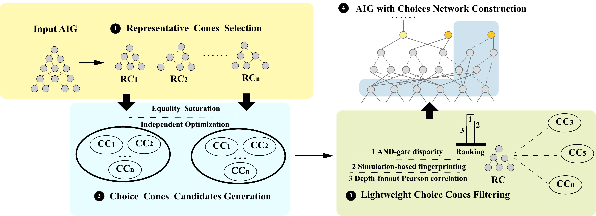

CRISTAL
===============================

CRISTAL is a novel methodology and framework for constructing Boolean choice networks for Technology Mapping. The framework includes representative logic cone search, structural mutation for generating diverse choice structures via equality saturation, and priority-ranking choice selection along with choice network construction and validation. Through these techniques, CRISTAL constructs fewer but higher-quality choices, leading to better delay after mapping and physical sizing and buffer timing optimization. By leveraging static timing evaluation, CRISTAL enables better alignment between technology mapping and physical synthesis.



Requirements
------------
* Rust environment (rustc, cargo)
* Berkeley ABC tool
* GNU Parallel
* bc (basic calculator)

Environment Setup
------------

### Installing Dependencies

**GNU Parallel:**
```bash
bash install_parallel.sh
```

**bc (basic calculator):**
```bash
sudo apt-get install bc
```

**Rust Environment:**

Ensure you have Rust installed. If not, install via [rustup](https://rustup.rs/):
```bash
curl --proto '=https' --tlsv1.2 -sSf https://sh.rustup.rs | sh
```

**Berkeley ABC:**

Make sure the ABC tool is installed and accessible in your PATH. For installation instructions, refer to the [ABC repository](https://github.com/berkeley-abc/abc).

Build
------------

To build the CRISTAL framework, run:

```bash
make
```

Usage
------------

### Preprocessing New Cases

Before running CRISTAL on new AIG files, preprocessing is required because CRISTAL's Rust parser needs the input and output signal names to be normalized. This ensures the ABC AIG extension parser can reliably add choices for further steps.

**Step 1:** Process your new AIG file:
```bash
python benchmarks/process.py <your_file.aig>
```

**Step 2:** Place the processed result in the `exp_aig` directory.

**Step 3:** Run the optimization scripts:
```bash
bash benchmarks/exp/benchmarks/areaopt.sh
bash benchmarks/exp/benchmarks/delayopt.sh
```

### Running Experiments

To run CRISTAL on a specific benchmark:

```bash
bash run_total_choice_mix.sh --case <benchmark>.aig
```

**Example:**
```bash
bash run_total_choice_mix.sh --case log2.aig
```

To run on multiple benchmarks:
```bash
bash run_total_choice_mix.sh --case *.aig
```

Citation
------------

If you use CRISTAL in your research, please cite our work published in ICCAD'25.

```bibtex
@inproceedings{chen2025Cristal,
  title={Revisit Choice Network for Synthesis and Technology Mapping},
  author={Chen Chen and Jiaqi Yin and Cunxi Yu},
  booktitle={ICCAD},
  year={2025},
}
```
